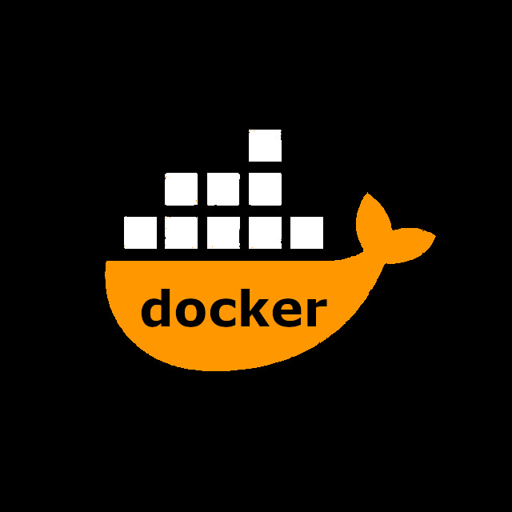
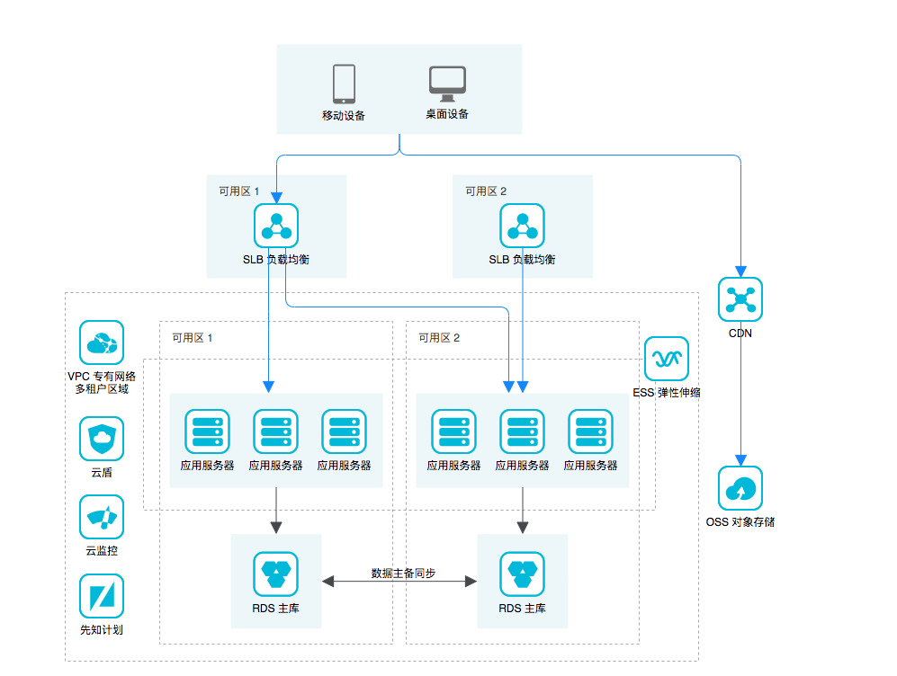

# 云->容器->未来

>   bboysoul

<!-- _color: black -->

<!-- _footer: ''-->

---

### 联系方式

博客: https://www.bboy.app
邮箱: bboysoulcn@gmail.com
telegram: https://t.me/bboysoul

---

上课的rules
- 多发弹幕
- 保持思维活跃，别睡着了
- 讲的不好，或者有错的地方大家可以随时提出来纠正，是人总会犯错
- 允许有喷子直接喷，鼓励喷，多一些反对的声音总是好的
- 听不懂的刷????

---

对大家的期望

- 希望可以带走一些东西

---

是开发的刷1 是运维的刷2 什么都不是的刷3

---

ppt真的准备了很久，几乎接近200页

---

希望可以刷波666

---

### 主题

- 云
- 容器
- 未来

---

### 云

---

我们直接来个🌰

---

假设我们有个图片网站架设在阿里云上(正规的)

---

### 最开始我们是这样使用云的

---

但是因为开发程序写的过于优秀

---

数据库和应用经常抢用资源，往往因为应用的内存爆满，导致数据库

`ERROR 2003 (HY000): Can't connect to MySQL server on ***.&&&.(((.$$$`

---

所以这个时候应该怎么操作？？？

---

# 花钱！！！

---

### 之后我们把数据库独立了出来

---

但是当访问并发上来我们发现一台应用服务器不够了

---

这个时候又该怎么操作？

---

# 花钱！！！

---

### 所以我们加了一台服务器

--- 

但是问题来了，用户怎么才可以访问应用服务器2号？

---

# 花钱！！！

---

所以我们加了一台负载均衡服务器

--- 

因为是图片网站，所以我们的图片都是存在服务器本地的，现在两台服务器，图片数据不同步来了怎么办？？？

---

# 花钱！！！

---

是不是应该加服务器？？？？？

---

NO NO NO

---

上云服务 ！！！

---

阿里云的对象存储oss

---

简单的介绍下，我们只看东西的功能特性

`https://help.aliyun.com/product/31815.html?spm=a2c4g.750001.list.23.4cc17b137hAUjP`

---

我们只需要引入oss的sdk，把所有程序上传的图片，都保存在阿里云的oss上就好了

---

不过随着业务的扩大，问题又又又来了

---

美国的小伙伴表示访问很慢，30秒过去了小姐姐的脸都刷不出来

---

这个时候应该怎么班？？？？

---

花钱！！！！加服务

---

阿里云的内容分发网络CDN

---

`https://help.aliyun.com/product/27099.html?spm=a2c4g.750001.list.88.4cc17b137hAUjP`

---

花钱！！！！加服务

---

阿里云的负载均衡服务slb

---

`https://help.aliyun.com/product/27537.html?spm=a2c4g.750001.list.70.4cc17b137hAUjP`

---

花钱！！！！加服务

---

阿里云的数据库服务RDS

---

`https://help.aliyun.com/product/26090.html?spm=a2c4g.750001.list.44.4cc17b134tiuWZ`

---

我们的程序是使用PHP(拍_片)写得

因为PHP是世界上最_的语言

所以容易收到黑客攻击

---

花钱！！！！加服务

---

阿里云的web应用防火墙waf

---

`https://help.aliyun.com/product/28515.html?spm=a2c4g.750001.list.200.4cc17b13ulpCnO`

---

以上是最基础的阿里云的架构，已经适用于很多公司了

---

而且从这个架构中，我们可以发现一个很简单的规律

---

钱是万能的，有钱真好！！！！

---

接下来我们看一下一些骚操作

---
游戏解决方案

---
灾备解决方案

---

云pos解决方案

---

基础架构搭建完了，那我们怎么去知道他是不是健康的？？

---

云上监控和告警

---

常见的监控软件

- prometheus
- zabbix
- nagios
- openfalcon

---

还有阿里云的云监控

---

阿里云云监控真的很好用，只不过不知道是我们在监控它，还是它在监控我们

---

### 玩监控最头痛的是什么东西

1. 告警不及时，告警途径少(都2020了，不会真的有人每天早上起来第一件事情就是看邮件吧，不会吧，不会吧)
2. 搭建复杂(都2020了，不会真的有人手动起agent吧)
3. 添加监控项累(都2020了，不会真的有人手动添加这种东西吧，不会吧，不会吧)
4. 有的地方不支持监控(都2020了，就算是家用路由器也应该能方便的监控起来吧)

---

### 我认为一个优秀的监控软件应该是怎样的

1. 监控项目要多(如果官方不支持，自己进行简单的开发也可以实现)(openfalcon很多监控项目不支持)
2. 界面漂亮(nagios，zabbix上古界面)
3. 添加配置项简单，最好可以自动添加(zabbix,批量添加太麻烦了，鼠标点的手痛)
4. 告警途径多(短信，企业微信，钉钉，邮件，slack，telegram)，最好全都支持(小孩子才做选择，我们成年人全部都要)
5. 部署搭建方便

---

那么能解决上面大部分问题的就只有prometheus了

--- 

需要监控的监控点

1. 应用状态监控(jvm 内存cpu等)
2. 主机状态监控(主机cpu 内存 连接数等)
3. api网关监控(流量，连接数，rps，qps)
4. 数据库监控(select,update,网络，慢查询等)
5. 业务监控(用户数，订单数，支付金额等)(数据大屏)
6. 硬件监控(cpu的温度，硬盘健康状态，环境湿度温度，ups电压等)
7. 业务的可访问性监控(定时发送请求，查看请求是否可以访问)
8. 阿里云云上rds，slb，oss，cdn监控

---

监控的架构图

---

下面介绍一些常用的监控exporter

---

对于应用状态监控，比如java的可以使用JMX exporter，go的话可以使用gokit，这些都是现成的，当然推荐使用集成prometheus的库去做开发，配置自己的监控点，目前prometheus官方支持以下的语言

- Go
- Java or Scala
- Python
- Ruby

---

非官方的支持

- Bash
- C
- C++
- Dart
- .NET / C#
- Node.js
- Perl
- PHP
- Rust

等等

---

所以说，开源的力量是伟大的

---

对于主机状态监控

linux下可以使用node-exporter
windows下可以使用windows_exporter

---

对于阿里云的监控我们可以使用aliyun-exporter

https://github.com/aylei/aliyun-exporter

---

使用prometheus最大的好处就是可以自己写exporter来监控自己所需要的数据

下面实际演示下prometheus监控树莓派的温度

---

这个时候问题又来了，很多公司的监控系统是搭建在云下的，但是业务是在云上的，我们怎么做才可以让云下云上相互访问保持相对安全

---

### 1. vpn网关

优点是云上云下直接打通成内网，但是需要本地网络和vpc网络的地址段不能相同SSL-VPN支持普通电脑连接，IPsec-VPN只能连接到数据中心的网关中，且网关需要静态的公网ip，需要支持IKEv1和IKEv2协议

---

### 2. 智能接入网关

有硬件版本和app版本，相对安全可靠，但是很贵

---

### 3. 使用跳板机

阿里云上搭建一个有公网ip的ecs，然后这台机器是可以访问阿里云vpc上其他机器的，可以使用安全组的安全策略来控制允许某个ip来访问这台机器，但是云下机器不能直接访问阿里云上所有机器

---

### 4. 使用nat网关

这是我目前在使用的方法，使用nat网关直接连接阿里云，使用安全组策略来控制允许某个ip访问阿里云，vpc内网服务可以使用dnat方式映射到公网，但是规则维护繁杂

---

### 5. 高速通道

直接物理专线连接，成本过于高，中小公司完全不用考虑

---

### 接下来的问题

不管我们使用跳板机，还是nat网关方式去让本地环境连接阿里云，我们都需要设置ip白名单，但是大部分的小公司都是没有固定的公网ip的，而且公司宽带的ip会不停变动，也就是说，当公司宽带ip变了，那么我们就需要重新手动配置白名单，这不经会增加运维人员的工作量，也会造成线下监控数据的丢失，所以有没有一种简单的方法，让程序自动去帮我们配置呢？这就需要用到阿里云的sdk了

---

### 阿里云sdk

阿里云提供了多种语言的sdk，比如java python go php等，也就是说我们可以使用程序去自动配置阿里云上的一些东西

比如上面这个要求自动修改安全组规则的需求，我们就可以直接这样做

查询公司目前ip地址->查询安全组上的ip地址->相互比较->如果公司ip地址修改了的话那么直接修改安全组上的对应规则->向钉钉发送一条安全组规则已修改的信息

---

下面查看代码演示

---

不仅仅是以上使用场景，比如公司本地数据库要迁移到阿里云的rds，数据是迁移上去了没错，但是有的公司数据库中有几百个用户，用人去手工创建显然是需要花很多时间的，这个时候就可以使用阿里云sdk去快速创建用户

---

还有一种使用场景就是可以与cicd流水线去配合使用，当我线上要发布一个服务，但是这个服务我只想运行到负载最低的这台机器上，那么我就可以使用阿里云的ecs sdk去查询哪一台机器负载最低，然后更新上线，在更新上线完成之后，我就需要去让用户访问这个服务，所以我们需要调用slb 的sdk把服务添加到对应的后端服务器组中

---

个人认为阿里云的sdk是阿里云运维和管理中十分重要的一个环节，合理使用可以解放很多的劳动力

--- 

### 现在我们图片网站的架构

###### 我们还缺点什么东西？？？

---

备份！！！！

---

我们要备份什么东西？

---

1. 日志
2. 数据库
3. 云上配置
4. 我们的小姐姐图片(非结构化数据)
5. ecs快照

程序要不要去做备份？

---

如何备份

---

1. 定时任务管理工具
2. 备份脚本

---

一般我会这么做，首先把所有的数据备份到oss的一个bucket中，这个bucket是单独挂载到一台ecs上的，这台ecs就负责跑每天的备份任务，所有的日志会rsync到这台服务器的oss bucket路径中，rds数据库必须要设置备份策略，备份完成之后调用sdk脚本同样下载到这台服务器的oss bucket路径中，slb，安全组，rds，nat网关等服务的配置也是调用sdk读取出来，然后转换成json或者csv格式备份到这台服务器的oss bucket路径中

---

这样大部分的备份都在oss里面了，之后我们只要定时把备份拉拉取到本地的备份服务器里面就可以了，而且实现的是云上云下双副本，云上丢失可以使用云下的恢复，云下丢失可以再去云上拉取

----

现在的架构

---

### 上午总结

对于运维来说，最重要的不是你会用什么工具，而是解决问题的思路，早上我们关注了整体的架构->监控->备份，这三块可以保证业务较为稳定去运行了，

---

# 云->容器->未来

>   bboysoul

<!-- _color: black -->

<!-- _footer: ''-->

---

# 容器

---

什么是容器

---

### 维基百科的解释

容器 (英语：Container) 是一种基础工具。泛指任何可以用于容纳其它物品的工具，可以部分或完全封闭，被用于容纳、储存、运输物品。物体可以被放置在容器中，而容器则可以保护内容物。

---

### 看下redhat的解释

Linux 容器技术能够让您对应用及其整个运行时环境（包括全部所需文件）一起进行打包或隔离。从而让您可以在不同环境（如开发、测试和生产等环境）之间轻松迁移应用，同时还可保留应用的全部功能。容器也是保障 IT 安全的一个重要组成部分。将安全性内置于容器管道，可以为您的基础架构增添防护，从而保障容器的可靠性、可扩展性和信赖度。

---

容器的本质，一句话解释，就是一组受到资源限制，彼此间相互隔离的进程。

容器=进程

---

### 容器的几个概念

- 容器
  
 (镜像（Image）和容器（Container）的关系，就像是面向对象程序设计中的 类 和 实例 一样，镜像是静态的定义，容器是镜像运行时的实体。容器可以被创建、启动、停止、删除、暂停等 。
  容器的实质是进程，但与直接在宿主执行的进程不同，容器进程运行于属于自己的独立的 命名空间。前面讲过镜像使用的是分层存储，容器也是如此。
  容器存储层的生存周期和容器一样，容器消亡时，容器存储层也随之消亡。因此，任何保存于容器存储层的信息都会随容器删除而丢失。

---

- 镜像(Docker 镜像是一个特殊的文件系统，除了提供容器运行时所需的程序、库、资源、配置等文件外，还包含了一些为运行时准备的一些配置参数（如匿名卷、环境变量、用户等）。 镜像不包含任何动态数据，其内容在构建之后也不会被改变。)
- 镜像仓库(存放镜像的地方)（dockerhub，ghcr）

---

docker演示

拉取镜像
启动容器
查看镜像
删除镜像(10.10.100.17)
往容器中复制文件
compose
把容器当工具使用(如果说系统中没有mysql命令怎么办)
使用docker搭建wordpress

---

还是觉得部署wordpress麻烦？？

---

尝试下play-with-docker

---

### 使用容器的好处

- 方便迁移环境
- 提高部署的效率
- 提高资源的利用效率
- 减少了因为环境差异所带来的风险

---

但是最关键的是

---

用了容器之后我们可以把应用当牲口来对待

---

---

什么是牲口，就是每天只需要把它放到草原上，他自己就可以吃草，自己就可以长大，人很少去关心他到底怎么去吃草，怎么长大，我们只需要等他长大到一定阶段宰了吃肉就可以了

---

什么是宠物，宠物是需要我们细心照顾的，还得关心他的心理生理上的健康，牲口只需要吃草这种简单的食物就好来，而宠物比如狗是需要吃上好的狗粮

---

---

有时候还需要陪他们出去玩

---

因为不陪他们玩他们就会拆家

---

---

很过分

---

总之一句话，牲口，人不需要花很多心思在上面，而宠物我们每天都要去关注

---

那么映射到我们应用上呢？？？

---

传统我们部署一个应用，要输入scp cd，mv java -jar，tail，kill等等等这些命令

---

要精心维护这个节点，而且需要时刻关注他的负载，一旦挂了，我们又需要手动登陆服务器操作，很累，很麻烦

---

当他需要更新的时候，我们又要

scp cd，mv java -jar，tail，kill

---

但是当应用容器化之后呢？？？？？

---

`docker-compose up -d`

---

一句命令搞定一切，直接把应用当牲口对待

---

这个就是所谓的

宠物模型  VS 牛群模型

---

宠物模型：管理员部署服务器或者虚拟机，并且对其持续进行维护。登录机器或容器，安装软件，完成配置，并且确保一切运行正常。因此，这些机器或者容器是管理员的宠物。

牛群模型：管理员把基础架构当成牛群模型时，他们并不关心基础架构某个组件的命运。管理员不会登录到任何单元里，也不会做手动处理。相反，他们使用批量方案，借助自动化工具完成部署、配置以及管理。如果某个服务器或者容器死机了，它会被自动复活，或者生成另一个服务器或者容器来替代有问题的组件。因此，在这种场景下，运维人员管理的是牛群模型。

---

如何专业高效养牛？？？？？

---

---

以前当我们只有几个容器的时候，我们扩展5个节点，可能需要输入5个有效命令，这个会让运维人员很头痛，因为运维最重要的品质就是

---

如何更好的偷懒

---

能让机器动的，绝对不要用手

---

所以我们需要一个管理容器的工具，管理容器，其实就是容器的编排

---

常用的容器编排工具

- kubernetes
- mesos
- swarm

---

Kubernetes 是一个可移植的、可扩展的开源平台，用于管理容器化的工作负载和服务，可促进声明式配置和自动化。Kubernetes 拥有一个庞大且快速增长的生态系统。Kubernetes 的服务、支持和工具广泛可用。

---

Apache Mesos 能够在同样的集群机器上运行多种分布式系统类型，更加动态有效率低共享资源。提供失败侦测，任务发布，任务跟踪，任务监控，低层次资源管理和细粒度的资源共享，可以扩展伸缩到数千个节点。

---

Docker Swarm就是一个把多个物理主机或者虚拟机组成的集群上的容器群进行管理的容器编排工具，负责编排、调度和集群管理，由集群的活动由集群管理器控制，加入集群的机器称为节点，允许用户管理跨多个主机部署的多个容器。

---

上面是我找的关于这三个工具的介绍，不知道大家有没有看懂

---

反正我没看懂

---

简而言之，他们都是管理容器的

---

来看下swarm的架构

---

---

接着看下kubernetes的架构

---

---

看不懂kubernetes架构？

---

没关系我们一点一点解释

---

master

API Server：提供了HTTP Rest接口的关键服务进程，是Kubernetes里所有资源的增、删、改、查等操作的唯一入口，也是集群控制的入口进程；
Controller Manager：负责维护集群的状态，比如故障检测，扩缩容，滚动更新等等；
Scheduler：负责资源的调度，按照预定的策略把pod调度到指定的node节点；
etcd：存储Kubernetes集群信息。

---

worker

kubelet：负责Pod对应的容器的创建、启停等任务；
kube-proxy：实现Kubernetes Service的通信与负载均衡机制的重要组件；
docker：Docker引擎，负责本机的容器创建和管理工作；
pod：Pod是Kubernetes中能够创建和部署的最小单元，是Kubernetes集群中的一个应用实例。Pod包含了一个“根容器”Pause和多个Docker容器；

---

我们再深入理解以下架构，来一个🌰

---

关于kubernetes是如何创建pod的

---

客户端提交创建请求，可以通过API Server的Restful API，也可以使用kubectl命令行工具。支持的数据类型包括JSON和YAML。

---

API Server处理用户请求，存储Pod数据到etcd。

---

调度器通过API Server查看未绑定的Pod。尝试为Pod分配主机。

---

过滤主机 (调度预选)：调度器用一组规则过滤掉不符合要求的主机。比如Pod指定了所需要的资源量，那么可用资源比Pod需要的资源量少的主机会被过滤掉。

---

主机打分(调度优选)：对第一步筛选出的符合要求的主机进行打分，在主机打分阶段，调度器会考虑一些整体优化策略，比如把容一个Replication Controller的副本分布到不同的主机上，使用最低负载的主机等。

---

选择主机：选择打分最高的主机，进行binding操作，结果存储到etcd中。

---

kubelet根据调度结果执行Pod创建操作： 绑定成功后，scheduler会调用APIServer的API在etcd中创建一个boundpod对象，描述在一个工作节点上绑定运行的所有pod信息。运行在每个工作节点上的kubelet也会定期与etcd同步boundpod信息，一旦发现应该在该工作节点上运行的boundpod对象没有更新，则调用Docker API创建并启动pod内的容器。

---

是不是很复杂？？？？

---

的确很复杂

---

所以swarm和kubernetes我们选哪一个？？

---

不要为了上kubernetes而上kubernetes

---

考虑实际需求

---

我只有两个容器要管理，需不需要？

---

我有30个容器要管理，但是我的公司在二三线小城市，需不需要？

---

我的应用都是有状态的，比如有的数据一定要存储在内存中，需不需要上？

---

我的应用需要很好的网络请求，比如延时必须在几毫秒之内，需不需要上？

---

都不需要

---

那么什么情况需要上kubernetes

---

- 业务量比较大，对于扩展节点自动扩容等功能需求比较高
- 可以允许一定的网络损耗
- 大部分应用都是无状态的，在任何节点都可以随时启动停止
- 使用的是微服务架构

---

上看是我个人的看法，当然还有其他的场景

---

总之一句话

---

适合自己才是最好的，如果你不想坐在宝马后哭，那就好好享受自行车带来的快感

---

之后带给大家小公司生产上的一个kubernetes架构

---

然后再来一张图

---

---

接下来我们了解下cncf

---

### 什么是cncf

CNCF，全称Cloud Native Computing Foundation（云原生计算基金会），口号是坚持和整合开源技术来编排容器作为微服务架构的一部分，致力于Github上的快速成长的开源技术的推广，如Kubernetes、Prometheus、Envoy等，帮助开发人员更快更好的构建出色的产品

---

为什么要讲这个

---

就和学linux需要知道linux基金会一样，学习云原生相关的也要知道cncf

---

所以什么是云原生

---

云，表示应用是运行于云端的，不是运行在线下的传统机房，原生表示应用在创建之初就应该考虑应用是云端环境中的，要充分利用云端弹性和分布式的特点

---

目前被cncf托管的项目

https://landscape.cncf.io/images/landscape.png

---

# 未来

---

我认为的未来是怎样子的

---

未来应该是serverless的

---

### 什么是serverless

无服务器运算，又被称为功能即服务，是云计算的一种模型。以平台即服务为基础，无服务器运算提供一个微型的架构，终端客户不需要部署、配置或管理服务器服务，代码运行所需要的服务器服务皆由云端平台来提供。

- AWS Lambda
- Azure Functions
- OpenFaaS
- 阿里云函数计算（Function Compute）

---

值得关注一点的是，无服务器并不是代表说真的不需要服务器了，而是你不需要关注服务器硬件，系统等等一系列的东西了，而会更加的去关注于业务

---

还是不懂？？？？

---

直接演示两个案例

---

阿里云上的serverless演示

---

需求

---

我个人习惯每天早上去看新闻，但是很懒，不想去打开网站，希望它可以定时直接用信息的形式推送给我

---

下面实际演示下openfaas

---

架构

---

---

需求

---

平时作为一个运维，最难受的就是执行长时间的挂机任务，导致运维生命中一半以上的时间都是等待中度过的，等待安装，等待编译，等待财务付款买服务器，等待领导同意审批，那么我现在要实现的就是当挂机任务完成之后自动在钉钉上发一个消息来让我们知道已经编译完成了比如 `make && curl -X POST -d '{"msg": "任务完成"}' http://faas.bboysoul.cn/function/dingding`

---

当然，当财务和领导完成他们的任务之后也可以让他们在终端输入这个命令来让我们知道任务完成了

---
题目

1. 以下哪一个不是阿里云的云服务(D)
A. ecs
B. rds
C. oss
D. ec2

---

2. docker开源版本改名之后叫什么(D)
A. podman
B. k3s
C. docker-ce
D. moby

---

3. 以下哪个不是kubernetes的组件(D)
A. apiserver
B. etcd
C. kubelet
D. alertmanager

---

4. 您基于阿里云的云服务器ECS实例部署了Mysql数据库，随着业务量的不断上涨，您自己部署的数据库的服务能力越来越不足，表现在并发连接数不足，磁盘的IOPS不能满足业务需要等，可以采用阿里云的 C 产品来解决这些问题。
A. 对象存储OSS
B. 表格存储
C. 云数据库RDS
D. 大数据分析ODPS

---

5. 阿里云的ecs全称是什么(D)
A. Elastic Container Service
B. Elastic Cloud Server
C. Elitegroup Computer Systems
D. elastic compute service

---

6. 以下那些是用来监控服务器的工具(AB)
A. openfalcon
B. zabbix
C. loki
D. rabbitmq

---

7. 以下和serverless相关的是(A,C,D)
A. AWS Lambda
B. ACK(Alibaba Cloud Container Service for Kubernetes)
C. OpenFaaS
D. 阿里云函数计算（Function Compute）

---
8. 下面那几个是容器编排常用的工具(ABC)
A. swarm
B. mesos
C. k8s
D. zstack

---

9. 以下那些是docker的核心概念(ABC)
A. 镜像
B. 容器
C. 仓库
D. 存储
  
---

10. 使用容器的好处(ACD)
A. 方便迁移环境
B. 提高程序的运行效率
C. 提高资源的利用效率
D. 减少了因为环境差异所带来的风险

---

11.  容器的本质是一种特殊的进程(对)
12.  serverless表示运行代码不需要服务器了(错)
13.  k8s中etcd是用来存储集群信息的(对)
14.  node-exporter是用来采集windows服务器监控信息的(错)
15.  oss+cdn可以解决图片的大量存储和快速访问两个问题(对)
